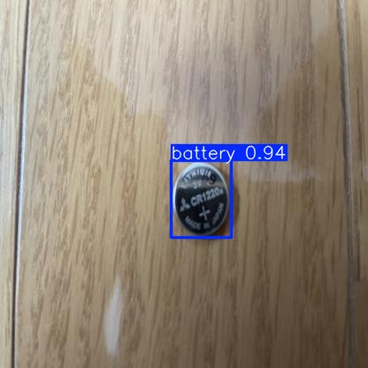

# Hệ Thống AI Nhận Diện Và Phân Loại Rác Thải (YOLO11s)

> **Hệ thống ứng dụng mô hình thị giác máy tính YOLO11s để tự động phát hiện, khoanh vùng và phân loại rác thải thành 7 nhóm theo thời gian thực trên nền tảng Web và Camera.**

[](https://github.com/ultralytics/ultralytics)
[](https://pytorch.org/)
[](#6-kết-quả-huấn-luyện-và-đánh-giá)
[](https://www.docker.com/)
[](#12-triển-khai-hệ-thống)

---

## 1. Giới thiệu tổng quan

Ô nhiễm rác thải là một trong những thách thức môi trường cấp bách nhất hiện nay. Việc phân loại rác chính xác ngay tại nguồn giúp tăng đáng kể tỷ lệ tái chế, giảm tải cho các bãi chôn lấp và tiết kiệm tài nguyên xã hội.

Dự án này xây dựng một giải pháp hoàn chỉnh từ **huấn luyện mô hình Deep Learning** đến **triển khai ứng dụng Web Full-stack**:
- **Nhận diện qua Webcam thời gian thực:** Độ trễ cực thấp (~20ms - 50ms trên GPU), bám dính vật thể liên tục.
- **Phân loại ảnh tĩnh:** Người dùng tải ảnh chụp từ điện thoại/máy tính để phân loại tự động.
- **Chỉ dẫn phân loại thông minh:** Hướng dẫn bỏ đúng màu thùng rác quy chuẩn (cam, xanh dương, xanh lá, vàng).
- **Lưu trữ lịch sử & Dashboard:** Thống kê định lượng số lượt phân loại, tỷ lệ các nhóm rác và xem lại ảnh đã quét.
- **Hiển thị thông số AI trực quan:** Trình diễn biểu đồ hàm mất mát (Loss Curve), ma trận nhầm lẫn (Confusion Matrix) và thông số kỹ thuật trực tiếp trên Web.

---

## 2. Các loại rác được phân loại (7 Nhóm)

Mô hình được huấn luyện để nhận diện chính xác 7 nhóm rác thải sinh hoạt phổ biến:

| STT | Nhãn Class | Tên tiếng Việt | Nhóm phân loại | Quy chuẩn màu thùng rác | Chỉ dẫn xử lý |
|:---:|:---|:---|:---|:---|:---|
| 1 | `battery` | **Rác pin** | Rác nguy hại | 🟠 Thùng Cam / Đỏ | Thu gom riêng, tuyệt đối không đốt hoặc chôn chung với rác thường |
| 2 | `cardboard` | **Bìa carton** | Rác tái chế | 🟡 Thùng Vàng / Xanh dương | Gấp phẳng, giữ khô ráo để chuyển đến nhà máy tái chế giấy |
| 3 | `paper` | **Rác giấy** | Rác tái chế | 🟡 Thùng Vàng / Xanh dương | Thu gom tập vở, sách báo cũ, không để dính dầu mỡ |
| 4 | `glass` | **Thủy tinh** | Rác tái chế | 🔵 Thùng Xanh dương | Rửa sạch chai lọ, phân loại riêng đồ vỡ để đảm bảo an toàn |
| 5 | `metal` | **Kim loại** | Rác tái chế | ⚪ Thùng Xám / Bạc | Vỏ lon nhôm, đồ hộp, nắp kim loại có thể tái chế vô hạn lần |
| 6 | `plastic` | **Rác nhựa** | Rác tái chế | 🟡 Thùng Vàng / Xanh dương | Chai nhựa PET, cốc nhựa, can nhựa, bóp xẹp trước khi bỏ thùng |
| 7 | `organic` | **Rác hữu cơ** | Rác phân hủy | 🟢 Thùng Xanh lá cây | Vỏ trái cây, cuống rau, thức ăn thừa thích hợp ủ làm phân compost |

---

## 3. Bộ Dữ Liệu Huấn Luyện (Dataset)

Bộ dữ liệu được xây dựng và cân bằng kỹ lưỡng thông qua kịch bản `balance_dataset.py`, được cấu hình trong file `data_balanced.yaml`.

### 📊 Thống kê phân chia dữ liệu:
* **Tổng số lượng ảnh:** **26.048 ảnh** gán nhãn chuẩn YOLO (Bounding Box: `class x_center y_center width height`).
* **Độ phân giải chuẩn:** `640 x 640 pixels`.

| Tập dữ liệu | Số lượng ảnh | Tỷ lệ phân chia | Mục đích sử dụng |
|:---|:---:|:---:|:---|
| **Train Set** | **18.320 ảnh** | **70.34%** | Cập nhật trọng số mạng nơ-ron qua thuật toán lan truyền ngược |
| **Validation Set** | **4.636 ảnh** | **17.80%** | Giám sát hiện tượng Overfitting và lưu checkpoint `best.pt` |
| **Test Set (Độc lập)** | **3.092 ảnh** | **11.87%** | Đánh giá khách quan năng lực tổng quát hóa của mô hình |
| **TỔNG CỘNG** | **26.048 ảnh** | **100%** | Đã cân bằng số lượng mẫu giữa 7 lớp rác |

---

## 4. Kiến Trúc Mô Hình & Quá Trình Huấn Luyện

Dự án lựa chọn kiến trúc **YOLO11s** (phiên bản thế hệ mới nhất của dòng YOLO do Ultralytics phát triển năm 2024 - 2025):

* **Số tầng (Layers):** 101 layers
* **Số lượng tham số (Parameters):** 9.415.509 tham số
* **Độ phức tạp tính toán:** 21.4 GFLOPs
* **File trọng số chính:**
  * `best.pt` (PyTorch FP32 - 72.5 MB) - Dùng cho GPU máy chủ / Localhost
  * `best.onnx` (ONNX Opset 12 INT8 Quantized - 9.4 MB) - Tối ưu cho Web Client

### ⚙️ Siêu tham số huấn luyện (Centralized in `config.py`):
```text
- Model Architecture: YOLO11s
- Total Epochs: 68 epochs (Early stopping trigger)
- Batch Size: 32
- Image Size: 640 x 640
- Optimizer: AdamW (lr0 = 0.001, weight_decay = 0.0005)
- Learning Rate Scheduler: Cosine Annealing (cos_lr = True)
- Data Augmentation: Mosaic (1.0), Mixup (0.15), Copy-Paste (0.3), Random Erasing (0.4)
- Close Mosaic: 15 Epochs cuối tắt Mosaic để tinh chỉnh viền Bounding Box
```

Quá trình huấn luyện chi tiết có thể theo dõi trong notebook: [`train_trash_yolo11_colab.ipynb`](train_trash_yolo11_colab.ipynb) hoặc file chạy mã nguồn [`train.py`](train.py).

---

## 5. Kết Quả Đánh Giá Mô Hình (Evaluation Metrics)

Kết quả đánh giá định lượng trên tập **Test Set độc lập (3.092 ảnh chưa từng xuất hiện lúc huấn luyện)**:

| Chỉ số đánh giá | Kết quả đạt được | Ý nghĩa chuyên môn |
|:---|:---:|:---|
| **Precision (Độ chuẩn xác)** | **90.3%** | Khi mô hình dự đoán là loại rác X, xác suất đúng thực tế đạt trên 90% |
| **Recall (Độ bao phủ)** | **80.6%** | Khả năng phát hiện và không bỏ sót các đối tượng rác trong khung hình |
| **mAP @ 0.50** | **81.3%** | Độ chính xác trung bình tại ngưỡng IoU tiêu chuẩn 50% |
| **mAP @ 0.50:0.95** | **66.6%** | Độ chính xác trung bình khắt khe trên dải ngưỡng IoU từ 50% đến 95% |
| **Inference Time (GPU)** | **15 - 20 ms / frame** | Đạt tốc độ **45 - 60 FPS**, đáp ứng tiêu chuẩn xử lý thời gian thực |

### 🖼️ Minh chứng kết quả nhận diện thực tế:

Dưới đây là kết quả kiểm thử thực tế của mô hình (file minh chứng `test_output.jpg`):



---

## 6. Các Kịch Bản Kiểm Thử (Testing Scripts)

Dự án cung cấp đầy đủ các kịch bản kiểm thử độc lập phục vụ kiểm tra và đánh giá học thuật:

* **`test_webcam.py`**: Khởi động trực tiếp luồng camera qua OpenCV, kết nối mô hình PyTorch CUDA trên card đồ họa, hiển thị HUD thông số FPS và hộp bounding box theo thời gian thực.
* **`test_image.py`**: Nhận diện ảnh đơn lẻ từ đường dẫn file, trích xuất tọa độ Bounding Box, Confidence Score và vẽ ảnh kết quả.
* **`test_api_endpoints.py`**: Tự động gửi request kiểm thử độ sẵn sàng (Health Check) và độ chính xác của các API endpoints (`/predict_image`, `/predict_frame`).
* **`test.py`**: Script thực thi kiểm tra và đánh giá tổng quát mô hình.

---

## 7. Kiến Trúc Hệ Thống (System Architecture)

Hệ thống được thiết kế theo kiến trúc hướng dịch vụ **Client - Server** hiện đại:

```text
┌─────────────────────────────────────────────────────────────┐
│                    GIAO DIỆN NGƯỜI DÙNG                     │
│    Vue.js 3 SPA • Bootstrap 5 • Chart.js • Bootstrap Icons │
│  (Dashboard, Realtime Camera, Tải ảnh lên, Lịch sử, Model)  │
└──────────────────────────────┬──────────────────────────────┘
                               │ REST API / WebSocket
                               ▼
┌─────────────────────────────────────────────────────────────┐
│                      WEB API SERVER                         │
│            Node.js Express (Cổng mặc định: 5000)            │
│  - Điều hướng nghiệp vụ, xử lý ảnh tải lên, ghi log lịch sử  │
└──────────────────────────────┬──────────────────────────────┘
                               │ Internal Proxy (Cổng 5001)
                               ▼
┌─────────────────────────────────────────────────────────────┐
│                   PYTHON AI MICROSERVICE                    │
│             Flask + PyTorch (CUDA) + ONNX Runtime           │
│  - Nạp best.pt (72.5MB) hoặc best.onnx (9.4MB)              │
│  - Tiền xử lý Letterbox 640x640, NMS, decode Bounding Box   │
└─────────────────────────────────────────────────────────────┘
```

---

## 8. Cấu Trúc Thư Mục Repository

```text
.
├── client/                          # Mã nguồn Frontend Vue.js 3
│   ├── dist/                        # Bản build tĩnh production sẵn sàng phục vụ
│   ├── public/                      # Tài nguyên tĩnh (WASM, Mô hình ONNX)
│   ├── src/                         # Components, Views, Routers, Services
│   │   ├── components/classify/     # WebcamClassifier & ImageClassifier
│   │   ├── views/                   # DashboardView, ModelInfoView, HistoryView...
│   │   └── services/                # api.js & yoloWebEngine.js
│   ├── package.json
│   └── vite.config.js
├── server/                          # Mã nguồn Backend Server
│   ├── config/                      # Cấu hình môi trường và đường dẫn lưu trữ
│   ├── controllers/                 # Bộ điều khiển logic (detection, history, stats)
│   ├── data/                        # File lưu trữ dữ liệu lịch sử nhận diện (JSON)
│   ├── repositories/                # Tầng truy xuất dữ liệu
│   ├── routes/                      # Định nghĩa các Route API (/api/predict, /history...)
│   ├── uploads/                     # Thư mục lưu ảnh đã phân loại
│   ├── server.js                    # Web server chính chạy Node.js Express
│   └── yolo_service.py              # Dịch vụ AI Python Flask kết nối YOLO model
├── best.pt                          # Trọng số mô hình PyTorch gốc (72.5 MB)
├── best.onnx                        # Mô hình ONNX INT8 siêu nhẹ cho web (9.4 MB)
├── data_balanced.yaml               # Cấu hình 7 nhãn và dataset
├── config.py                        # Cấu hình siêu tham số huấn luyện
├── balance_dataset.py               # Script cân bằng tỷ lệ mẫu dữ liệu
├── train.py                         # Script huấn luyện YOLOv11s trên Local
├── train_trash_yolo11_colab.ipynb   # Notebook huấn luyện trên Google Colab
├── test_webcam.py                   # Kiểm thử nhận diện webcam qua Python CUDA
├── test_image.py                    # Kiểm thử nhận diện trên ảnh tĩnh
├── test_api_endpoints.py            # Kiểm thử tự động các đầu API
├── test_output.jpg                  # Ảnh mẫu minh chứng kết quả kiểm thử
├── requirements.txt                 # Danh sách thư viện Python cần thiết
├── Dockerfile                       # Cấu hình đóng gói Docker Container
├── docker-compose.yml               # Cấu hình chạy cụm Docker Compose
├── start.sh                         # Kịch bản khởi động song song AI & Web trên Linux
├── DEPLOY_GUIDE.md                  # Hướng dẫn chi tiết triển khai hệ thống
├── .dockerignore
├── .gitignore
└── README.md
```

---

## 9. Hướng Dẫn Cài Đặt & Chạy Localhost

### 📋 Yêu cầu môi trường:
* **Hệ điều hành:** Windows 10/11 hoặc Linux Ubuntu
* **Python:** 3.10 hoặc 3.11
* **Node.js:** 18.x hoặc 20.x LTS
* *(Tùy chọn cho hiệu năng tối đa):* Card đồ họa NVIDIA hỗ trợ CUDA 11.8 / 12.x

### 🚀 Các bước cài đặt:

1. **Clone repository về máy:**
   ```bash
   git clone https://github.com/Vzuong/trash-ai.git
   cd trash-ai
   ```

2. **Cài đặt thư viện Python:**
   ```bash
   pip install -r requirements.txt
   ```

3. **Cài đặt thư viện Node.js cho Server:**
   ```bash
   cd server
   npm install
   cd ..
   ```

4. **Khởi động hệ thống:**
   * **Cửa sổ 1 (Khởi động Python AI Service):**
     ```bash
     python server/yolo_service.py
     ```
     *(Dịch vụ AI sẽ chạy ngầm tại cổng `http://127.0.0.1:5001`)*

   * **Cửa sổ 2 (Khởi động Web Server):**
     ```bash
     node server/server.js
     ```
     *(Web Server sẽ lắng nghe tại cổng `http://localhost:5000`)*

5. **Truy cập ứng dụng:**
   Mở trình duyệt truy cập: **`http://localhost:5000`**

---

## 10. Chạy Ứng Dụng Bằng Docker

Hệ thống đã được đóng gói toàn diện trong Docker image đa tầng:

```bash
# Xây dựng và khởi chạy container bằng Docker Compose
docker compose up --build -d

# Xem log hoạt động
docker compose logs -f
```
Sau khi khởi động, truy cập ứng dụng tại: `http://localhost:7860` (hoặc port được cấu hình).

---

## 11. Các Script Kiểm Thử Nhanh

```bash
# 1. Kiểm thử trên webcam máy tính (yêu cầu webcam)
python test_webcam.py

# 2. Kiểm thử trên 1 tấm ảnh mẫu
python test_image.py

# 3. Kiểm tra tính toàn vẹn của các API Endpoint
python test_api_endpoints.py
```

---

## 12. Triển Khai Hệ Thống (Cloud Deployment)

Hệ thống đã được cấu hình CI/CD và triển khai thực tế trên máy chủ đám mây **Render**:
* **Link Demo Trực Tuyến:** **[https://trash-ai-68ei.onrender.com](https://trash-ai-68ei.onrender.com)**
* **Kiến trúc Cloud:** Docker Container (Debian Linux, Python 3.11, Node.js 20, ONNX Runtime).

---

## 13. Hạn Chế Thực Tế & Hướng Phát Triển

### ⚠️ Hạn chế hiện tại:
1. **Môi trường ánh sáng:** Độ chính xác nhận diện có thể giảm trong điều kiện thiếu sáng mạnh hoặc ánh sáng ngược chói.
2. **Vật thể biến dạng:** Rác bị dập nát, cháy xém hoặc bị che khuất trên 70% diện tích có thể bị phân loại nhầm.
3. **Phạm vi phân loại:** Hiện tại chỉ giới hạn trong phạm vi 7 lớp rác đã học; các loại rác đặc thù (rác y tế, linh kiện điện tử lớn) chưa được hỗ trợ.

### 🌟 Hướng phát triển:
* Thu thập thêm dữ liệu thực tế tại các bãi tập kết rác tại Việt Nam để mở rộng tập dữ liệu lên > 50.000 ảnh.
* Tích hợp thêm các lớp rác thải công nghệ (E-waste) và rác thải nguy hại y tế.
* Nghiên cứu triển khai mô hình lên các thiết bị nhúng phần cứng chuyên dụng (Raspberry Pi 5, NVIDIA Jetson Nano) để lắp đặt trực tiếp vào nắp thùng rác thông minh tự động mở nắp theo màu.
